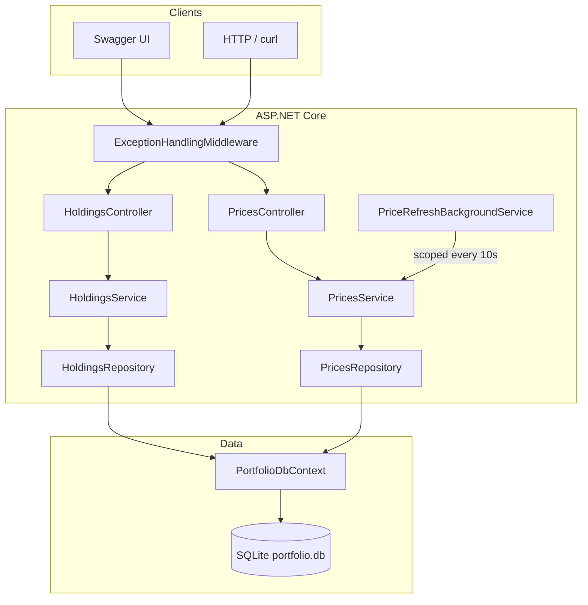

# Portfolio Holdings Dashboard

A .NET 8 Web API backend for managing portfolio holdings, tracking live (simulated) stock prices, and calculating unrealized profit and loss. This repository contains the **backend API**; use **Swagger UI** as the interactive client for local development and demos.

## Prerequisites

| Tool | Version |
|------|---------|
| [.NET SDK](https://dotnet.microsoft.com/download) | 8.0+ |

Optional: [EF Core CLI](https://learn.microsoft.com/en-us/ef/core/cli/dotnet) for manual migrations.

```bash
dotnet tool install --global dotnet-ef
```

---

## 1. Setup & Run (< 5 minutes)

### Clone the repository

```bash
git clone <repository-url>
cd verracloud-takehome-ovais
```

### Run the backend

```bash
cd PortfolioApi
dotnet restore
dotnet run
```

On first startup the API will:

- Apply EF Core migrations to `portfolio.db` (SQLite, created in `PortfolioApi/`)
- Seed price data for **AAPL**, **MSFT**, **JPM**, **T**, **GS**
- Start a background service that refreshes prices every **10 seconds**

| Resource | URL |
|----------|-----|
| Swagger UI (interactive API) | http://localhost:5205/swagger |
| API base URL | http://localhost:5205 |

### Run the frontend

This repository does **not** include a separate SPA frontend. For take-home review and local testing:

1. Start the backend (above).
2. Open **Swagger UI** at http://localhost:5205/swagger to list holdings, add positions, view prices, and trigger a manual refresh.

If you add a frontend (e.g. React/Vite) in a sibling folder, point it at the API:

```bash
# Example — after creating a frontend project
cd portfolio-ui
npm install
npm run dev
```

Set the API base URL in your frontend env (e.g. `VITE_API_URL=http://localhost:5205`) and enable CORS on the API if the UI runs on a different origin.

### Quick smoke test

```bash
# List seeded prices
curl http://localhost:5205/api/prices

# Add a holding
curl -X POST http://localhost:5205/api/holdings \
  -H "Content-Type: application/json" \
  -d "{\"ticker\":\"AAPL\",\"quantity\":10,\"purchasePrice\":170.00}"

# List holdings with P&L
curl http://localhost:5205/api/holdings
```

Sample requests are also in `PortfolioApi/PortfolioApi.http`.

### Database migrations (optional manual run)

Migrations run automatically on startup. To apply manually:

```bash
cd PortfolioApi
dotnet ef database update
```

To create a new migration after model changes:

```bash
dotnet ef migrations add <MigrationName> --output-dir Data/Migrations
```

---

## 2. Architecture Overview

The API follows a **layered architecture**: HTTP concerns stay in controllers; business rules live in services; data access is isolated in repositories; EF Core handles persistence.



| Layer | Responsibility |
|-------|----------------|
| **Controllers** | Routing, HTTP status codes, request/response DTOs |
| **Services** | Validation, P&L calculation, price refresh logic (±2%) |
| **Repositories** | Async CRUD against `Holdings` and `Prices` |
| **Data** | `PortfolioDbContext`, migrations, seed data |
| **Middleware** | Global JSON error handling (400 / 404 / 500) |
| **BackgroundServices** | Periodic price refresh via scoped `IPricesService` |

### API endpoints

| Method | Route | Description |
|--------|-------|-------------|
| `GET` | `/api/holdings` | All holdings with `currentPrice`, `marketValue`, `unrealizedPnL` |
| `POST` | `/api/holdings` | Add holding (validated ticker, quantity, purchase price) |
| `DELETE` | `/api/holdings/{id}` | Remove holding (404 if not found) |
| `GET` | `/api/prices` | All current prices |
| `POST` | `/api/prices/refresh` | Manually apply ±2% price simulation |

### Project layout

```
PortfolioApi/
├── Controllers/          # HTTP API
├── Services/             # Business logic
├── Repositories/         # Data access interfaces + implementations
├── Models/               # EF entities
├── DTOs/                 # API contracts
├── Data/                 # DbContext, seeder, migrations
├── Middleware/           # Exception handling
├── BackgroundServices/   # 10s price refresh
├── Validators/           # FluentValidation rules
└── Extensions/           # DI registration
```

---

## 3. AI Usage Log

Document how AI assisted this submission. Update dates and details to match your actual session.

| Date | Tool | How it was used | Human review |
|------|------|-----------------|--------------|
| 2026-05-24 | Cursor (Claude) | Scaffolded the full backend from the take-home spec: EF Core models, repositories, services, controllers, middleware, background service, migrations, and `Program.cs` wiring | Reviewed structure, naming, and business rules; verified `dotnet build` and local `dotnet run` |


### What AI generated

- Layered project structure and most C# source files
- NuGet package choices (EF Core SQLite, FluentValidation, Serilog, Swagger)
- Initial EF migration and database seeder
- DI registration and hosted background service pattern

### What was verified manually

- Build succeeds with zero errors
- API starts, migrates DB, seeds five tickers
- Holdings CRUD and price refresh behavior
- Error responses for duplicate ticker and invalid input

### Principles followed when using AI

- Treated AI output as a **first draft**; did not commit without reading diffs
- Kept scope to the existing `PortfolioApi` project (no new solution)
- Ran the app locally to confirm behavior matches the spec

---

## 4. Design Decisions

### Why did you structure the backend the way you did?

**Separation of concerns.** Controllers only deal with HTTP; services own business rules (P&L, duplicate ticker checks, supported tickers); repositories encapsulate EF Core queries. That keeps each layer testable and easy to change without rippling through the app.

**Repository + service pattern.** Interfaces (`IHoldingsRepository`, `IPricesRepository`, `IHoldingsService`, `IPricesService`) make unit testing straightforward and hide persistence details from API code. This is a common enterprise pattern interviewers and teams expect on growing codebases.

**DTOs at the boundary.** Entities (`Holding`, `Price`) are not exposed directly. Response DTOs include computed fields (`marketValue`, `unrealizedPnL`) so clients get a stable contract without leaking ORM shapes.

**Cross-cutting middleware.** A single exception handler returns consistent JSON (`ErrorResponse`) instead of scattering try/catch in every controller.

**Background refresh with scoped services.** `PriceRefreshBackgroundService` creates a scope per tick so `DbContext` and repositories remain thread-safe and aligned with ASP.NET Core DI lifetimes.

**SQLite for the take-home.** Zero external dependencies for reviewers: clone, `dotnet run`, done. Production would swap the provider via configuration, not restructure layers.

### How would you scale this if 10,000 users were hitting it simultaneously?

**1. Replace SQLite with a managed database**  
Use **PostgreSQL** or **SQL Server** with connection pooling, read replicas for heavy read traffic (`GET /api/holdings`, `GET /api/prices`), and proper indexing on `Holdings.Ticker` and `Prices.Ticker`.

**2. Scale the API horizontally**  
Run multiple stateless API instances behind a **load balancer** (Azure App Service, AWS ALB, Kubernetes). No in-memory session state; all instances share the database.

**3. Decouple price updates from request path**  
The 10-second refresh should not run N times on N instances. Move price simulation to a **single worker** or **scheduled job** (Azure Functions, Hangfire, message consumer) that writes to the DB; APIs only read prices. Optionally cache latest prices in **Redis** with short TTL for read-heavy endpoints.

**4. Caching**  
Cache `GET /api/prices` (and optionally aggregated holdings) in Redis. Invalidate or short TTL (1–5s) so P&L stays fresh without hammering the database on every request.

**5. Async and resilience**  
Keep async end-to-end; add **timeouts**, **retries**, and **circuit breakers** for any external market-data APIs if real feeds replace the simulator.

**6. Rate limiting and CDN**  
Apply rate limiting per API key/IP at the gateway. Serve a static frontend from a **CDN** so 10k users do not hit the API for assets.

**7. Observability**  
Structured logging (Serilog → Application Insights / ELK), health checks (`/health`), metrics on request latency and DB pool usage, and alerts on error rate.

**8. Security**  
Authentication (JWT/OAuth), HTTPS everywhere, secrets in Key Vault, and least-privilege DB accounts.

At 10k **concurrent** users, the first bottlenecks would likely be SQLite and per-instance background refresh; fixing those two (shared DB + centralized price worker + horizontal API scale) is the highest-impact path.

---

## Tech stack

- .NET 8, ASP.NET Core Web API  
- Entity Framework Core 8 + SQLite  
- FluentValidation, Serilog, Swashbuckle (Swagger)

## License

Take-home submission — see repository owner for usage terms.


# Portfolio Holdings Dashboard (Frontend)

React + Redux Toolkit + RTK Query UI for the Portfolio API.

## Prerequisites

- Node.js 18+
- [Portfolio API](../PortfolioApi) running at `http://localhost:5205`

## Setup

```bash
cd portfolio-dashboard
npm install
cp .env.example .env   # optional — defaults match the API dev URL
```

## Run

```bash
# Terminal 1 — API
cd ../PortfolioApi
dotnet run

# Terminal 2 — UI
npm run dev
```

Open http://localhost:5173

## Features

- **Holdings table** — ticker, quantity, purchase/current price, market value, color-coded P&L, row delete, 5s auto-refresh
- **Add holding form** — client validation + API error display
- **Portfolio summary** — total market value, total unrealized P&L, position count

## Project structure

```
src/
├── components/     # UI building blocks
├── pages/          # Route-level views
├── store/          # Redux store configuration
├── services/api/   # RTK Query base API + endpoints
├── hooks/          # Derived state hooks
├── utils/          # Formatting, validation, errors
└── styles/         # Global and dashboard CSS
```

## Configuration

| Variable | Default |
|----------|---------|
| `VITE_API_BASE_URL` | `http://localhost:5205` |
